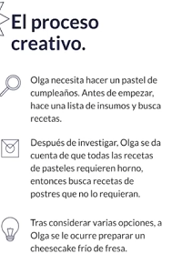
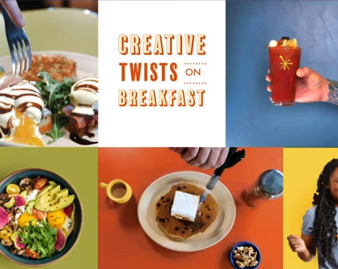
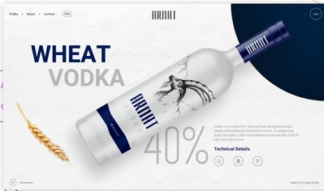
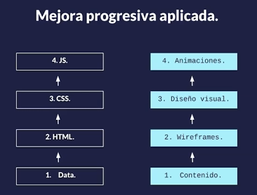

# Fundamentos

El proceso de creatividad se basa en algunos pasos que pueden hacerse hasta incoscientemente, consiste en:

1. Preparación - Se investiga y recopila la información con algo que se quiera solucionar
2. Incubación - Se experimenta, se prueban otras soluciones
3. Iluminación - Se ocurre la idea y se imagina
4. Evaluación - Se evalua si la practica es viable, se crítica y/o se replantea
5. Implementación - Se construye y se trabaja en la idea

Este proceso no solo aplica para diseño, se aplica en cualquier aspecto

¡**La creatividad es algo que se desarrolla**!

## Conceptos básicos de diseño

### Balance

El balance en el diseño gráfico se refiere a la distribución equitativa de los elementos visuales dentro de una composición, asegurando que ninguna parte del diseño esté sobrecargada o desbalanceada. El balance puede ser de dos tipos principales:

1. Balance Simétrico: Se caracteriza por una composición donde los elementos están dispuestos de manera igual o similar a ambos lados de un eje central. En este tipo de balance, los elementos reflejan una distribución precisa, ya sea vertical u horizontal, generando una sensación de estabilidad y orden.
   **Ejemplo de balance simétrico**:
   

2. Balance Asimétrico: A diferencia del balance simétrico, en el balance asimétrico los elementos no se distribuyen de manera igualitaria. En lugar de depender de la simetría, se basa en el contraste de tamaño, color o forma para crear una sensación de equilibrio dinámico y visualmente interesante.

   **Ejemplo de balance asimétrico**:
   

### Contraste

El contraste es una herramienta clave en el diseño que permite destacar elementos y crear énfasis al mostrar diferencias marcadas entre ellos. El contraste puede generarse a través de varios factores, como:

- Colores (claro vs. oscuro, cálido vs. frío).
- Tamaños (grande vs. pequeño).
- Formas (orgánicas vs. geométricas).

El contraste ayuda a dirigir la atención del espectador hacia elementos específicos de la composición y facilita la comprensión del mensaje.

### Alineación

La alineación es la manera en que los elementos de una composición se organizan en relación unos con otros o con el diseño general. Da coherencia y claridad, creando una estructura visual que guía la mirada del usuario por la composición. La alineación puede ser:

- Izquierda, derecha o centrada.
- Vertical u horizontal.

Una buena alineación da sensación de orden y facilita la legibilidad.

### Proximidad

La proximidad en el diseño se refiere a la relación espacial entre los diferentes elementos. Agrupar elementos relacionados entre sí, ya sea de manera física (cercanía) o conceptual (uso de colores, formas similares), permite al espectador reconocer conexiones lógicas o temáticas. Esta técnica se usa para organizar la información visualmente, lo que facilita la comprensión y mejora la experiencia del usuario.

### Repetición

La repetición se usa para crear coherencia y consistencia dentro de un diseño, lo cual refuerza la identidad visual. Es particularmente importante en el diseño de marca, donde se utilizan elementos repetidos como colores, formas, tipografías o patrones para construir una identidad fuerte y reconocible. También puede servir para establecer ritmo visual en la composición, lo que guía el ojo del espectador.

### Espacio

El uso del espacio, también conocido como "espacio en blanco" o "espacio negativo", es fundamental para dar respiro a los elementos de un diseño. El espacio no tiene que estar lleno para ser efectivo; dejar áreas sin elementos puede mejorar la claridad, ayudar a definir jerarquía y dar una sensación de organización. Se puede aprovechar para dirigir la atención hacia áreas específicas y crear un diseño limpio y equilibrado.

## Diseños responsivos (Responsive design)

Es una metodología de diseño que diseña para dispositivos moviles primero, separa las capas de contenido y funcionalidad y usa sistemas de grillas y columnas.

### Metodologias de responsive desing

Hay múltiples metodologías para hacer un responsive design

#### Metodología: Progresiva

Es la más recomendable donde se tiene una base sólida en la que se les va añadiendo mejoras dependiendo de factores como tamaño de pantalla o SO

#### Metodología: Agraciada

Se parte en una versión completa con todas las animaciones, etc y de ahí se parte para que se adapten a tables, dispositivos moviles, etc. Ideal para cuando primero se hizo la versión de desktop

## Accesibilidad y diseño

La accesibilidad es importante porque se debe de dar acceso a todas las personas independientemente de su discapacidad al ser la web universal.

### Tips Básicos

- Utilizar encabezados de manera ordenada para organizar la estructrua del contenido (HTML5 semántico)
- Utiliza tamaños de fuentes accesibles
- Utiliza colores que tengan un constrante adecuado
- Garantiza que el código de color no sea la única forma de relacionar contenido
- Diseñar teniendo en cuenta los estados de focus y active
- Añader etiquetas y textos descriptivos a los campos de formulario
- Escribir contenido descriptivo que pueda reemplazar vídeos e imagenes
- Garantizar que las animaciones no bloqueen el acceso al contenido

## Brief

Es la hoja de ruta para empezar a diseñar. Es el resultado de las conversaciones con el cliente e incluye datos sobre marca, objetivos y requerimientos de un proyecto

### Secciones del brief

Secciones más comunes son:

- Descripción del cliente o empresa
- Objetivos o retos
- Target o audiencia
- Competencia
- Distribución
