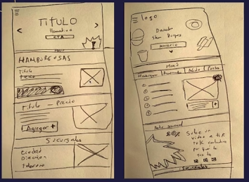

# Diseño UX

Es un diseño que se centra en los usuarios y en la usabilidad, se debe de diseñar un softeare como una buena persona, respetuoso, generoso y colaborador

El diseño UX tiene múltiples etapas que son:

1. Investigación
2. Análisis
3. Diseño
4. Pruebas de usuario

## User flow / Diagramas de flujo

Lo que se hace es que se toma los elementos del brief y se pasan a elementos tangibles, donde se debe de empezar con los requerimientos

## Wireframes

Es un bosquejo que deben de tener todas las secciones del aplicativo, es tener un inventario de lo que debe de tener la página web, ejemplo:

