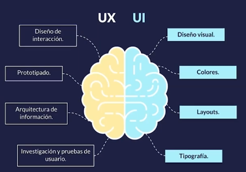
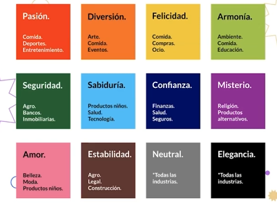
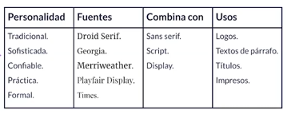
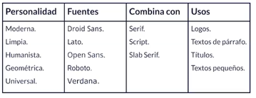

# Diseño UI

Es el diseño enfocado en la capa de estilos visuales que va por encima de la estructura de contenido, aquí se puede evidenciar las diferencias entre UX y UI

El aplicar estos dos diseños es de vital relevancia para que sea una pagina funcional y agradable

## Moodboard y línea gráfica

Un moodboard es una colección de referencias visuales que se usa como fuente de inspiración para un diseño

## Teoría del color

Psicología del color: Es un área de estudio que se dedica a investigar la forma en la que el cerebro percibe a los colores y los asocia a conceptos y sentimientos

### Color para web

Se recomienda utilizar RGB y hexadecimales, crear código de color consistentes (Que dos botones que hacen lo mismo sean de color distinto), menos es más, el exceso de color hace que los uusarios no se puedan enfocar en una acción a la vez. La elección de color debe de ser accesible, colores que funcionan bien con texto por encima, suficiente contraste, etc. Por último, se debe de definir una paleta de color (esta se crea antes de diseñar)

## Paletas de color

Para construir una paleta de color, se debe de considerar que hay colores primarios, secundarios y terciarios, un primario son los básicos, un secundario son los que se crean en base a un primario con un secundario y por último, los terciarios se crean en base de combinar entre un circulo cromatico de un color primario y un color secundario.

Hay diferentes tipos de paletas que se pueden usar que son:

- Combinación monocromática - Un color + Diferente opacidad
- Combinación análoga - Combina un color primario, secundario y terciario que estén seguidos en un circulo crómatico
- Combinación complementaria - Primario vs secundario que están opuestos en el circulo crómatico
- Combinación trádica - Crea un triangulo en el circulo crómatico
- Combinación tétrada - Combina dos colores primarios y dos secundarios

## Tipografia

¿Cómo elegirla? Mantener el número de fuentes al mínimo, máximo 3, se recomienda tratar de usar fuentes estándar ya que están probadas que sirven en múltiples dispositivos. Las páginas de web no son libros, se debe de limitar la cantidad de texto. Se debe de elegir tipografias que sean legibles en diferentes tamaños, manteniendo altos de línea espaciados (evitar líneas muy pegadas entre sí). Se debe de evitar tener animaciones intermitentes como si fuera powerpoint.

Se recomiendan los tipos de fuente como son:

- Serif:
  
- Sans Serif
  
- Script - Se puede usar en logos, no se recomienda para parrafos largos
  

## Layout y sistemas de grillas

¿Qué es una grilla? Es un sistema de columna basado en nuestras necesidades donde se ubicarán los elementos, la mejor herramienta de css para grillas es CSS Grid

## Sistemas de componentes UI

Es un conjunto de componente que se usarán para crear una página web

## Themes

Es una capa de color y estilos que se añade en la aplicación, ejemplos, el light theme y dark theme

## Imágenes para web

Se debe de tener claro el formato de las imagenes, jpg es para fotografías o imágenes con degradados, png es para imagenes decorativas que requieran un fondo transparente, se recomienda más jpg y dejar png solo cuando es transparente debido a que png es más pesado. Otros formatos son svg es indicado para iconos y animaciones de baja complejidad, es vectorial y permite editar sus propiedades con CSS y gif, este no es recomendado debido a que puede ser muy pesado.

Se debe de elegir imagenes que realmente aporten el contenido, las imagenes son un extra y no debe de ser un elemento abandonado. Las imagenes se deben de usar para que el público objetivo se vea reflejado. Además, se debe de elegir imágenes consistentes con tu paleta de colores y con cuidado con las licencias.

### Rendimiento y accesibilidad

Se debe de evitar exportar imágenes con texto incrustado por temas de accesibilidad, se debe de exportar las imágenes al tamaño del contenedor final. Además, se debe de considerar estrategias como lazy loading, añadir alt text a las imagenes, etc.

## Gráficos en movimiento para web

Existen algunos formatos de gráficos en movimiento como:

- CSS animado - Animaciones sencillas y transiciones
- SVG animado - Animaciones de elementos vectoriales
- JS (Canvas, WebGL) - Animaciones complejas como animaciones de datos o 3D
- Videos - Indicado para filmaciones y animaciones de alta complejidad y corta duración

Una pagina que se tarde mucho en empezar, está perdiendo usuarios por lo que se debe de revisar mucho las optimizaciones

Al elegir gráficos en movimiento se debe de elegir animaciones que aporten al contenido, procurar que no se reproduzcan automáticamente y si lo hacen, que no tengan sonido. También se debe de evitar que las animaciones tengan flashes, si las animaciones aportan al contenido, añade subtítulos o transcripciones. Se debe de evitar que las animaciones bloqueen la lectura básica del contenido, las animaciones y vídeos afectan el rendimiento de la página.
