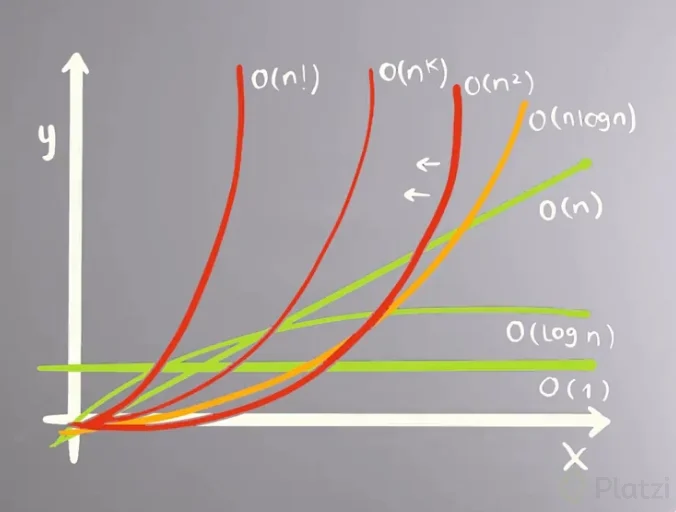

# Curso de entrevistas técnicas: Estructuras de datos y algoritmos

## ¿Qué son las estructuras de datos?

Son formas de almacenar y organizar la información para facilitar su uso y manipulación. Se dividen en **estructuras lineales** y **no lineales**.

- **Lineales**: Almacenan los datos en una secuencia, facilitando el acceso y recorrido en un orden específico. Ejemplos: arrays, strings, listas enlazadas, pilas, colas.
- **No lineales**: Almacenan los datos de manera jerárquica o en red, lo que permite relaciones complejas entre elementos. Ejemplos: grafos y árboles.

## ¿Qué son los algoritmos?

Son secuencias de pasos o instrucciones diseñadas para resolver un problema específico o realizar una tarea.

## ¿Por qué es importante aprender las estructuras de datos y algoritmos?

Existen muchas maneras de resolver un problema, pero algunos enfoques son más eficientes y elegantes que otros. Conocer estructuras de datos y algoritmos permite elegir soluciones optimizadas en términos de rendimiento y uso de recursos.

## ¿Qué estructuras de datos y algoritmos aprender?

Hay muchas estructuras y algoritmos, pero los más importantes para empezar son aquellos que se combinan bien con patrones de diseño para resolver problemas de manera efectiva.

### Estructuras de datos

Las estructuras básicas de datos incluyen:

- **Arrays**
- **Strings**
- **Listas enlazadas**
- **Tablas de hash y conjuntos de hash** (hash tables, hash sets)
- **Pilas**
- **Colas**
- **Árboles**
- **Grafos**
- **Tries**

### Conceptos y algoritmos clave

- **Notación Big O**: Evalúa la eficiencia en tiempo y espacio de los algoritmos.
- **Algoritmos de ordenamiento** (e.g., quicksort, mergesort)
- **Algoritmos de búsqueda** (e.g., búsqueda binaria)
- **Búsqueda en profundidad (DFS) y en anchura (BFS)**
- **Manipulación de bits**
- **Recursión**: Algoritmos que se llaman a sí mismos para dividir el problema en subproblemas.
- **Programación dinámica**: Resuelve problemas dividiendo en subproblemas y almacenando soluciones intermedias para evitar recomputaciones.

### Patrones de diseño

- **Dos apuntadores**
- **Ventana deslizante**
- **Apuntador rápido y lento**

## ¿Cómo es una entrevista con problemas de programación?

Se recomienda preparar una introducción sobre tus proyectos, experiencias y objetivos. Durante la entrevista, el entrevistador plantea el problema, y se sugiere **profundizar en el entendimiento del problema**. Luego, hacer preguntas para aclaraciones y trabajar en una solución.

### Criterios de evaluación en empresas tecnológicas grandes

Las empresas suelen evaluar en estos cuatro aspectos:

1. **Comunicación**: Habilidad para trabajar en equipo y expresar ideas claramente.
2. **Conocimiento técnico**: Nivel de dominio en estructuras de datos, calidad del código y claridad en las soluciones.
3. **Pruebas**: Validación del código y habilidades de testing.
4. **Capacidad de resolución de problemas**: Habilidad para llegar a soluciones y mejorarlas cuando sea necesario.

## ¿Cómo resolver un problema de programación?

Sigue estos pasos:

1. **Hacer preguntas**: ¿Qué valores se esperan? ¿Tipos de datos? ¿Tamaño de la entrada? ¿Qué importancia tiene el rendimiento?
2. **Identificar casos de uso** (incluyendo casos extremos): Visualizar ejemplos de entrada y salida posibles.
3. **Diseñar la solución** (sin implementarla aún): Define si priorizas rendimiento o uso de espacio, y divídelo en partes si es necesario. Consulta con el entrevistador.
4. **Implementar**: Piensa en voz alta y comunica tus decisiones, demostrando un razonamiento claro.
5. **Probar el código**: Elige un caso representativo y ejecuta la lógica paso a paso.

## Consejos para entrevistas

### Preparación

Es importante aprender a comunicar tus ideas y razonamientos, no solo resolver problemas.

#### Consejos de preparación

1. **Plan de estudio**: Alterna entre teoría y práctica en tiempos limitados.
2. **Práctica guiada**: Intenta resolver problemas por 20 minutos y luego revisa soluciones alternativas.
3. **Recursos**: Usa recursos online para complementar tu estudio.
4. **Guía de patrones**: Identifica patrones comunes que puedan aplicarse a múltiples problemas.

#### Consejos para la ejecución de entrevistas

1. No empieces a programar de inmediato.
2. Evita escribir pseudocódigo si no ayuda.
3. **Selecciona un lenguaje** en el que te sientas cómodo.
4. Asegúrate de **entender el problema** antes de comenzar.
5. **Establece metas claras** para cada parte del problema.
6. Familiarízate con complejidades y practica diferentes problemas.
7. **Escribe código limpio y legible**.
8. **Usa nombres significativos** para variables.
9. Prueba el código paso a paso.

## Notación Big O

La notación Big O es una métrica que permite describir la cantidad de recursos, especialmente tiempo y espacio, que un algoritmo requiere en función de la cantidad de datos de entrada.

### Tipos de complejidad en Big O (de mejor a peor)

1. **O(1)**: Constante - Independiente del tamaño de la entrada.
2. **O(log n)**: Logarítmica - Se reduce a la mitad en cada paso (e.g., búsqueda binaria).
3. **O(n)**: Lineal - Crece proporcional al tamaño de la entrada.
4. **O(n log n)**: Lineal-logarítmica - Frecuente en algoritmos de ordenamiento eficientes.
5. **O(n²)**: Cuadrática - Crece al cuadrado del tamaño de la entrada (e.g., algoritmos de fuerza bruta).
6. **O(n³)**: Cúbica - Aumenta con el cubo del tamaño de la entrada, generalmente menos eficiente.
7. **O(n!)**: Factorial - La peor complejidad, crece extremadamente rápido y debe evitarse en lo posible.

## Ejemplo de complejidad líneal en python

Para determinar la complejidad total del código, sumamos las complejidades de cada sección:

1. **Inicialización de variables** (`suma = 0` y `multiplicacion = 1`):

   - **Complejidad**: \(O(1)\) (Constante)

2. **Primer bucle `for`** (`for numero in range(len(lista))`):

   - Este bucle recorre todos los elementos de `lista`, y el tamaño de `lista` es `n`.
   - **Complejidad**: \(O(n)\) (Lineal)

3. **Segundo bucle `for`** (`for numero in range(len(lista))`):

   - Igual que el primer bucle, recorre todos los elementos de `lista`, y su complejidad también es \(O(n)\).

4. **Retorno de valores** (`return suma, multiplicacion`):
   - **Complejidad**: \(O(1)\) (Constante)

### Suma de complejidades

La complejidad total se calcula sumando las complejidades de cada parte:

\[
O(1) + O(n) + O(n) + O(1) = O(2n + 2)
\]

Sin embargo, en notación Big O, ignoramos constantes, por lo que la complejidad total del código complejidad_lineal.py es:

\[
O(n)
\]

#### Analizando busqueda binaria

Analizando la complejidad de busqueda_binaria.py, cada parte de la función de búsqueda binaria:

1. **Inicialización de variables** (`apuntador_izquierdo` y `apuntador_derecho`):

   - **Complejidad**: \(O(1)\) (Constante)

2. **Bucle `while`** (`while apuntador_izquierdo <= apuntador_derecho`):

   - En cada iteración del bucle, el tamaño de la búsqueda se reduce a la mitad, ya que cada vez descartamos la mitad de los elementos restantes al ajustar `apuntador_izquierdo` o `apuntador_derecho`.
   - Por lo tanto, el número de iteraciones es aproximadamente \(\log_2(n)\), donde \(n\) es el tamaño de `lista`.
   - **Complejidad**: \(O(\log n)\)

3. **Operaciones dentro del bucle** (`punto_medio`, comparación y ajustes de apuntadores):
   - Cada operación dentro del bucle tiene una complejidad de \(O(1)\) y se ejecuta en cada iteración del bucle.
   - No afectan la complejidad general, ya que se ejecutan en un número limitado de veces por cada iteración del bucle.
4. **Retorno de valores** (`return punto_medio` o `return "Lista no ordenada"`):
   - **Complejidad**: \(O(1)\) (Constante)

##### Suma

La complejidad total de la función es:

\[
O(1) + O(\log n) + O(1) = O(\log n)
\]

Por lo tanto, la **complejidad total de la función de búsqueda binaria es \(O(\log n)\)**.

## Complejidad Logarítmica

La **complejidad logarítmica**, denotada como \(O(\log n)\), se da en algoritmos donde la cantidad de datos a procesar se reduce a la mitad en cada paso, como en la **búsqueda binaria**. Esta complejidad es eficiente, ya que incluso para grandes volúmenes de datos, el número de operaciones crece muy lentamente.

En algoritmos de **ordenamiento eficientes** como **Merge Sort** y **Quick Sort**, se observa una **complejidad combinada de \(O(n \log n)\)**. En estos casos, \(n \log n\) resulta de realizar \(O(\log n)\) divisiones y luego procesar cada una de las \(n\) partes, ofreciendo un balance entre eficiencia y precisión.

## Complejidad Cuadrática

La **complejidad cuadrática**, denotada como \(O(n^2)\), ocurre en algoritmos donde una operación debe realizarse \(n\) veces para cada uno de los \(n\) elementos, como en el caso de algoritmos de ordenamiento más básicos, como el **Bubble Sort** o el **Selection Sort**. La complejidad cuadrática es mucho menos eficiente con volúmenes grandes de datos y puede volverse ineficaz a medida que \(n\) crece.

Cuando un algoritmo tiene varias partes con diferentes complejidades, se considera solo la de mayor impacto. Esto es importante porque refleja el crecimiento asintótico del tiempo de ejecución o uso de memoria en el peor caso, que es la principal preocupación en la optimización de algoritmos.

## Recursos recomendados

### Libros

- Cracking the coding interview
- Grokking algorithms
- Clean Code
- Introduction to algorithms - Thomas H. Cormen

### Plataformas

- Leetcode
- HackerRank
- CodeChef

### Para practicar entrevistas

- Pramp
- Interviewing.io
