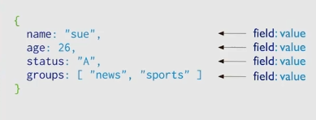

# Curso de introducción a MongoDB

Este motor de base de datos es considerado como NoSQL basado en documentos.

## Bases de datos NoSQL

Hay múltiples familias de NoSQL como son:

- Documentales - Emparejan cada clave con una estructura de datos compleja que se denomina documento, MongoDB forma parte, también está Firestore y Couchbase.
- Grafos - Se enfocan a representar la información sobre redes de datos como conexiones sociales, la más popular es neo4j
- Clave - Valor - Son las NoSQL más simples. Cada elemento de la base de datos se almacena como un nombre de atributo junto con su valor, la más popular es redis
- Orientadas a columnas - Permiten realizar consultas en grandes conjuntos de datos y almacenan los datos en columnas en lugar de filas, la más popular es Cassandra o HBase

El escalamiento horizontal es una de las particularidades más extraordinarias en bases de datos NoSQL

La replicación es la tecnica que se tiene un punto central como un balanceador de carga y este asigna las peticiones a múltiples nodos escalados a nivel horizontal.

Las BD noSQL son ideales para alta disponibilidad.

## Documentos y colecciones

Los documentos en MongoDB es la forma en la que se almacena la información dentro de un dominio, un dominio puede ser el inventario de una tienda, las clases de un curso que se puede asociar a un negocio. El documento es la forma en la que se organiza y almacena información con un conjunto de pares clave - valor.

Las colecciones es la forma en la que se almacenan los datos, usualmente con campos comunes entre sí.

## JSON vs BSON

Un JSON es amigable, se puede leer y es un formato muy sado

| Concepto en SQL | Concepto en MongoDB       | Descripción                                                                                                |
| --------------- | ------------------------- | ---------------------------------------------------------------------------------------------------------- |
| **Tabla**       | **Colección**             | Conjunto de datos relacionados. En SQL se definen con un esquema fijo, en MongoDB es flexible.             |
| **Fila**        | **Documento**             | Representa un registro. En SQL, cada fila sigue el mismo esquema; en MongoDB, cada documento puede variar. |
| **Columna**     | **Campo**                 | Atributo o propiedad de un registro. En SQL es rígido, en MongoDB puede variar entre documentos.           |
| **Relaciones**  | **Embebido o Referencia** | En SQL, se usan claves foráneas; en MongoDB, se pueden embebir documentos o usar referencias.              |

## Mongo atlas

Es el proveedor en la nube de mongodb, se puede crear un cluster gratuito
