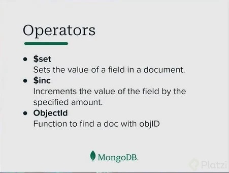
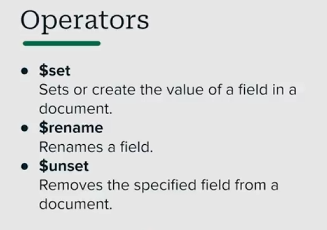
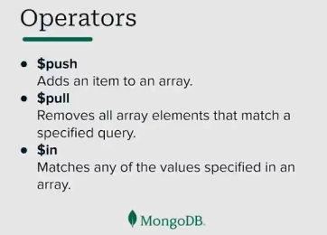
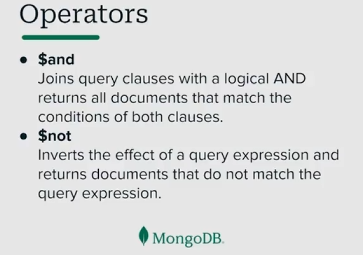
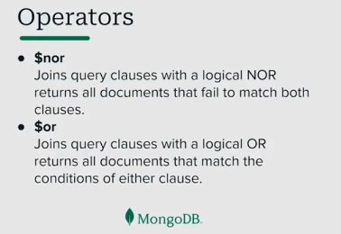
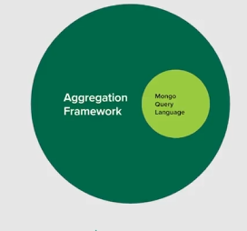

# **Curso de Introducción a MongoDB**

MongoDB es un motor de base de datos NoSQL basado en documentos, diseñado para manejar grandes volúmenes de datos y ofrecer flexibilidad en la estructura de almacenamiento.

---

## **Bases de Datos NoSQL**

Las bases de datos NoSQL se dividen en varias categorías, cada una con un enfoque distinto:

1. **Documentales**
   Emparejan cada clave con una estructura de datos compleja denominada documento. Ejemplos:

   - **MongoDB**
   - Firestore
   - Couchbase

   **Ejemplo en MongoDB:**

   ```json
   {
     "nombre": "Producto 1",
     "precio": 10.99,
     "categorias": ["oficina", "escolar"]
   }
   ```

2. **Grafos**
   Enfocadas en representar relaciones en redes, como conexiones sociales. Ejemplo:

   - Neo4j

3. **Clave-Valor**
   Las más simples. Almacenan datos como pares clave-valor. Ejemplo:

   - Redis

   ```json
   "usuario123": "activo"
   ```

4. **Orientadas a Columnas**
   Diseñadas para manejar consultas en grandes conjuntos de datos. Ejemplos:
   - Cassandra
   - HBase

### **Escalamiento Horizontal y Replicación**

- **Escalamiento Horizontal:** Característica clave en bases de datos NoSQL, donde se distribuyen datos entre múltiples nodos.
- **Replicación:** Técnica que utiliza un balanceador de carga para distribuir solicitudes a varios nodos, garantizando alta disponibilidad.

---

## **Documentos y Colecciones**

### **Documentos**

Un documento es una estructura de datos que almacena pares clave-valor y representa una entidad dentro de un dominio.

**Ejemplo:**

```json
{
  "producto": "Lápiz",
  "precio": 1.5,
  "disponible": true,
  "stock": 150
}
```


### **Colecciones**

Las colecciones agrupan documentos con características comunes. En MongoDB, no es necesario que todos los documentos de una colección sigan el mismo esquema.

---

## **JSON vs BSON**

| **Formato** | **Características**                                                              |
| ----------- | -------------------------------------------------------------------------------- |
| **JSON**    | Legible, ampliamente utilizado, pero con tipos de datos limitados.               |
| **BSON**    | Binario, eficiente en espacio y rendimiento, admite tipos avanzados como `Date`. |

**Ejemplo BSON vs JSON:**

- JSON:

```json
{ "nombre": "Juan", "edad": 25 }
```

- BSON: Representación binaria del anterior, optimizada para máquinas.

---

## **Mongo Atlas**

Mongo Atlas es una plataforma en la nube que permite gestionar clusters de MongoDB fácilmente. Ofrece un plan gratuito para comenzar.

---

## **Comandos Docker**

```bash
docker-compose up -d mongo   # Inicia un contenedor de MongoDB
docker-compose ps            # Lista los contenedores en ejecución
```

---

## **Operaciones CRUD en MongoDB**

### **UpdateOne**

Permite modificar documentos con operadores como:

- **`$set`**: Actualiza un campo específico.
- **`$inc`**: Incrementa un valor numérico.



También existen rename y unset


**Ejemplo:**

```js
db.productos.updateOne({ nombre: "Lápiz" }, { $set: { precio: 2.0 }, $inc: { stock: -10 } });
```

### **Operadores para Arrays**

- **`$push`**: Agrega un elemento al final de un array.
- **`$pull`**: Elimina un elemento del array.
- **`$in`**: Permite extraer múltiples elementos.

**Ejemplo:**

```js
db.usuarios.updateOne({ nombre: "Ana" }, { $push: { hobbies: "ciclismo" }, $pull: { hobbies: "ajedrez" } });
```



---

## **Consultas Avanzadas**

### **Operadores Comparativos**

- `$gt`: Mayor que.
- `$gte`: Mayor o igual que.
- `$lt`: Menor que.
- `$lte`: Menor o igual que.

**Ejemplo:**

```js
db.productos.find({ precio: { $gte: 10 } });
```

### **Expresiones Regulares**

MongoDB soporta búsquedas avanzadas con expresiones regulares:

```js
db.usuarios.find({ nombre: { $regex: "^Juan", $options: "i" } });
```

### **Projection**

Controla qué campos se devuelven en una consulta.

```js
db.productos.find({}, { nombre: 1, precio: 1, _id: 0 });
```

---

### **Operadores Lógicos en MongoDB**

MongoDB incluye operadores lógicos que permiten combinar condiciones en consultas. Los más comunes son:

---

#### **`$and`**

Permite combinar múltiples condiciones y devuelve los documentos que cumplen con todas ellas.

**Ejemplo:**

```js
db.productos.find({
  $and: [{ precio: { $gte: 10 } }, { categoria: "oficina" }],
});
```

**Traducción:** Busca productos con un precio mayor o igual a 10 y que pertenezcan a la categoría "oficina".

---

#### **`$or`**

Devuelve los documentos que cumplen al menos una de las condiciones especificadas.

**Ejemplo:**

```js
db.productos.find({
  $or: [{ precio: { $lte: 5 } }, { stock: { $gte: 100 } }],
});
```

**Traducción:** Busca productos con un precio menor o igual a 5 o con un stock mayor o igual a 100.

---

#### **`$not`**

Filtra documentos que no cumplan con la condición especificada.

**Ejemplo:**

```js
db.productos.find({
  precio: { $not: { $gte: 20 } },
});
```

**Traducción:** Busca productos cuyo precio no sea mayor o igual a 20.

---

#### **`$nor`**

Devuelve los documentos que no cumplen con ninguna de las condiciones especificadas.

**Ejemplo:**

```js
db.productos.find({
  $nor: [{ categoria: "escolar" }, { disponible: true }],
});
```

**Traducción:** Busca productos que no pertenezcan a la categoría "escolar" y no estén disponibles.



---

¿Te gustaría que añada ejemplos más complejos o algún caso práctico? 😊

## **Relación SQL vs MongoDB**

| **Concepto en SQL** | **Concepto en MongoDB**   | **Descripción**                                                                        |
| ------------------- | ------------------------- | -------------------------------------------------------------------------------------- |
| **Tabla**           | **Colección**             | Conjunto de datos relacionados, esquema flexible.                                      |
| **Fila**            | **Documento**             | Registro individual, con estructura flexible.                                          |
| **Columna**         | **Campo**                 | Atributo de un documento.                                                              |
| **Relaciones**      | **Embebido o Referencia** | En MongoDB, se pueden embebir documentos o usar referencias para conectar colecciones. |

## Expressive operator

## Aggregation framework

Herramienta pensada para data science con insides más profundos, con Mongo Query Language, permite buscar datos a nivel de escalas, funciona como tuberias donde tiene múltiples fuentes y extrae un resultado

