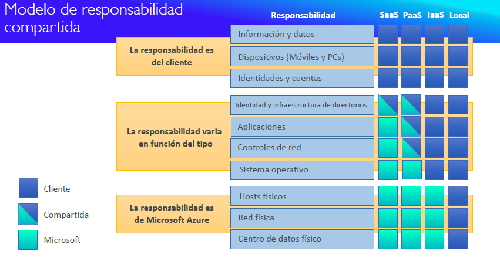

# Cloud computing

Con un enfoque tradicional de IT teniendo una infraestructura local, puede tener muchas desventajas como un escalado limitado, se debe de contratar un equipo de infraestructura, el costo puede ser muy alto y es difícil preveer alguna catástrofe, entonces con cloud computing se externaliza toda la infraestructura.

El cloud computing es el suministro bajo demanda con precios de pago por uso, se puede aprovisionar exactamente el tipo y tamaño, son casi al instante y evita tener un espacio físico

## Modelos de despliegue del cloud

Existen:

- Cloud privado como vmware donde uno tiene control total, seguridad para aplicaciones sensibles y satisfacen necesidades especificas.
- Cloud público, AWS, GCP o Azure.
- Cloud híbrido, combina la infraestructura tradicional con la de la nube.

## Características del cloud computing

1. Autoservicio, bajo demanda
2. Amplio acceso a la red
3. Alquiler múltiple y agrupación de recursos, permite tener múltiples clientes que comparten los mismos recursos físicos
4. Rapida elasticidad y escalabilidad, permite adquirir y disponer de recursos de forma automática y rápida, además escala rápida y fácilmente en función de la demanda
5. Servicio medido, el uso se mide y los usuarios pagan por lo que se ha utilizado realmente.

## Ventajas del cloud computing

1. Cambio del gasto de capital por el gasto operativo porque no se posee el hardware
2. Se beneficia de economías de escala masivas ya que los precios se reducen por la gran escala
3. Deja de adivinar la capacidad
4. Aumenta la velocidad y la agilidad con la globalización
5. Deja de gastar dinero en el funcionamiento y el mantenimiento de los centros de datos
6. Globalización en unos minutos

El cloud permite **flexibilidad**, **rentabilidad**, **escalabilidad**, **elasticidad**, **alta disponibilidad con tolerancia de fallos** y **agilidad**

## Diferentes tipos de cloud computing

- IaaC - Proporciona bloques de construcción para la IT en el cloud, proporciona redes, ordenadores y espacio de almacenamiento de datos. Permite máximo nivel de flexibilidad y fácil paralelismo con la IT tradicional en las instalaciones. Las máquinas virtuales o EC2 cuentan como IaaC. (Azure Virtual Machines o EC2)
- PaaS - Plataforma como servicio, elimina la necesidad de que la organización gestione la infraestructura subyacente, se centra en el despliegue y la gestion de las aplicaciones. En Azure un ejemplo es **App Services** o heroku. (Azure App Service, Beanstalk, Heroku o Google App Engine)
- SaaS - Un producto completo que es ejecutado y gestionado por el proveedor de servicios (Azure Cognitive Services, Gmail, Dropbox, Zoom, etc.)

## Precios

Azure tiene 3 fundamentos de precios, siguiendo el modelo de precios de pago por uso

### Computación

Se paga por el tiempo de computación

### Almacenamiento

Paga por los datos almacenados en el cloud

### Transferencia de datos fuera del cloud

La transferencia de datos hacia dentro es gratuita, pero sacarla si puede costar.

## Vista general de azure

A pesar de que AWS lidera el mercado cloud, azure ha tenido un incremento graduable, los casos de uso incluyen IT para empresas, copias de seguridad y almacenamiento, alojamiento de sitios web, aplicaciones móviles y sociales o de inteligencia artificial y machine learning.

## Pilares fundamentales del cloud

1. Gobernanza, el cloud ofrece herramientas y prácticas que permiten a las organizaciones gestionar y supervisar sus recursos en la nube, asegurando el cumplimiento de políticas y estándares.
2. Confiabilidad, garantiza un funcionamiento estable y constante del servicio, reduciendo fallos y maximizando el tiempo de actividad
3. Previsibilidad (Predicción), capaciddades analíticas que permiten anticipar el comportamiento de los recursos
4. Manejabilidad, facilita el monitoreo, gestión y administración de recursos de la nube
5. Seguridad, protege integralmente los datos, aplicaciones y redes con soluciones avanzadas que detectan y responden a amenazas

## Modelo de responsabilidad compartida

## Resumen de lo aprendido

1. En el modelo de Plataforma como Servicio (PaaS), sólo gestionas los datos y las aplicaciones.
2. En el Cloud Computing, sólo se te cobra por lo que utilizas.
3. El cloud tiene 5 características que son rápida elasticidad y escalabilidad, alquiler múltiple y agrupación de recursos y autoservicio bajo demanda.
4. La computación, el almacenamiento y la transferencia de datos fuera del Cloud de Azure son los 3 fundamentos de los precios.
5. El cloud provee ventajas como cambiar el CAPEX por el OPEX, globalización en minutos y dejar de gastar dinero en funcionamiento y mantenimiento de los centros de datos.
6. El cloud computing es disponibilidad bajo demanda de los recursos de un sistema informático, especialmente del almacenamiento de datos en la nube y de la potencia de cálculo, sin una gestión activa directa por parte del usuario.
7. El modelo de responsabilidad compartida define quién es responsable de qué en el Cloud de Azure.
8. El uso de un modelo de despliegue de Cloud híbrido te permite beneficiarte de la flexibilidad, la escalabilidad y el acceso al almacenamiento bajo demanda, manteniendo la seguridad y el rendimiento de tu propia infraestructura
