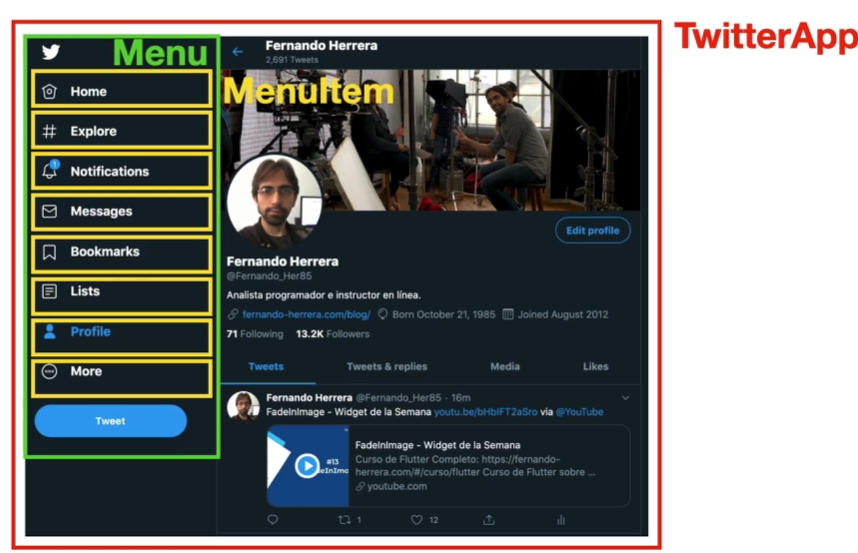

# Primeros pasos en React

## ¿Qué se verá en esta sección?

- Nuestra primera aplicación - Hola Mundo
- Exposiciones sobre los componentes
- Creación de componentes (Functional Components)
- Propiedades - Props
- Impresiones en el HTML
- PropTypes
- DefaultProps
- Introducción general a los Hooks
- useState

## Componentes en react

¿Qué es un componente? Es una pequeña pieza de código reutilizable y encapsulada que tenga estado o no. ¿Qué es un componente? Todo es un componente. Se recomienda que usen PascalCase

## ¿Pero qué es un estado

Los componentes tienen un renderizado de estado adicional, cada vez que el usuario realiza una acción, cambia el estado, el estado en resúmen es como se encuentra la información del componente en un determinado momento del tiempo.

## ¿Cómo crear una app de react?

Hay dos formas, se puede usar una aplicación como Create React App (CRA) que cuenta con múltiples dependencias ya preconfiguradas.

Con CRA se crea con npm porque trae el archivo package-lock.json, este archivo cuenta con información de como fue construidas las dependencias de node.
