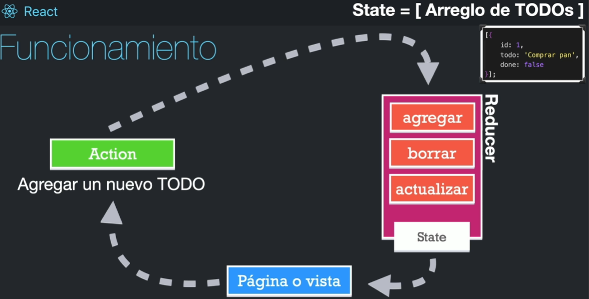

# useReducer

## Temas puntuales por aprender

¿Qué veremos en esta sección?

- useReducer
- Reducers
- Teoría de un reducer
- Aplicación de TODOs
- CRUD local

Esta es una sección dedicada a comprender el concepto de un Reducer, el cual es sumamente importante para poder entrar a Redux o bien usar el contextAPI fácilmente.

## ¿Qué es un reducer?

Es una función común y corriente, es más sencilla porque no puede ser asíncrona.
Debe de ser una función pura, debe de retornar un **nuevo estado**. Usualmente sólo recibe dos argumentos, el valor inicial y la acción a ejecutar.

```js
const miFunction = () => {};
const miReducer = () => {};
```

El reducer no debe de tener efectos secundarios, debe de poder acabar con todo lo solicitado sin llamar funciones auxiliares.
No debe de realizar tareas asíncronas, debe de retornar siempre un estado nuevo. No debe de llamar localStorage o sessionStorage. Para modificar el state, no debe de requerir más que una accion que puede tener un argumento.

```js
const initialTodos = [{ id: 1, todo: 'comprar pan', done: false }];
const todoReducer = (state = initialTodos, action) => {
  return state;
};
```

La idea es tener en un solo lugar las posibles modificaciones a un estado, en los reducer debería de estar los CRUD.


## Reducer

La lógica de actualización de estado distribuida en varios controladores de eventos puede ser agobiante, por esta razón se consolida toda esta lógica en una única función llamada `reducer`

```js
const [state, dispatch] = useReducer(reducer, initialArg, init);
```

En el ejemplo anterior, se desestructura el state y dispatch, el dispatch es la función que despacha las acciones, para enviar las acciones al useReducer.

[Documentación](https://es.react.dev/reference/react/useReducer)

## Local Storage y cookies

Las cookies viajan en las peticiones HTTP de manera implicita, mientras que el local storage no a menos que se haga de manera explicita en una petición fetch, este permite almacenar la información en la computadora y a menos que se eliminen los datos o se cambie de computadora / navegador, la información persistirá. 
