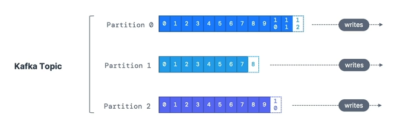

## Kafka topics
Los kafka topics son un flujo particular de datos dentro del cluser kaska, se pueden llamar logs, purchases, etc. Un topic en kafka o tema en kafka es un flujo de datos, podría ser equivalente a una tabla en base de datos pero sin constraints. Se envía lo que se quiera a un tema kafka sin verificaciones, se pueden tener cuantos uno quiera y la forma de identificar un tema son por su nombre. Los temas kafka soportan cualquier formato de mensaje como JSON, Avro, txt, etc. La seucnecia de mensajes de un tema se denomina flujo de datos o "data stream" porque los datos fluyen a través de los temas. No se pueden consultar los temas como con SQL, para eso, se debe de usar Kafka productores para enviar datos y Kafka consumidores para leer los datos.

Los temas o topics están divididos en particiones, ejemplo, un tema puede estar dividido por 100 particiones, los mensajes dentro de cada partición son ordenados por medio de un id empezando en 0. Cada mensaje como se comentó, tiene un id incremental, este se le llama "offset"

Los temas de kafka con inmutables, una vez la información se escribe en una partición, no puede ser cambiada, es decir, no se puede eliminar datos en kafka ni actualizarla. En un ejemplo donde se tienen varios productores que envían datos a un topic de apache kafka, pueden haber múltiples consumidores que consumen del mismo stream data. Ejemplo, un servicio de localización, un servicio de correos y otro servicio de notificaciones push pueden estar leyendo del mismo flujo de datos o stream data.

## Topics, partitions y offsets
Una vez la aplicación escribe en un topic, la información no puede cambiar porque son inmutables. Esta información se retendrá en Kafka, por defecto se retendrá por una semana, después, los datos desaparecerán. 

Los offset solo tienen un significado para una partición en especifico, es decir, el offset 3 en la partición 1 no significa la misma información que el offset 3 de la partición 0 o de la 2. Los offsets no son reutilizados incluso si la información ha sido ya eliminada o consumida. El orden de la información se puede asegurar dentro de una partición, no entre diferentes particiones.

Los datos son asignados aleatoriamente a una partición a menos que se tenga una llave y se pueden tener tantas particiones por topic como uno quiera.

## Producers
Los producers escriben datos en los topics (que están compuestos por particiones), el productor o producer sabe de antemano a que partición escribir la información, es incorrecto pensar que kafka decide a qué partición se escribirá la información, el que lo decide es el producer. En caso que un broker se caiga, los producer cambiar automáticamente a un broker estable. Esta carga está balanceada a muchos prokers gracias al número de particiones que se puede tener.